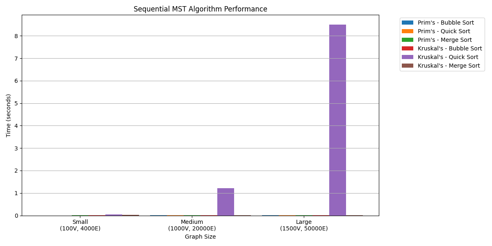
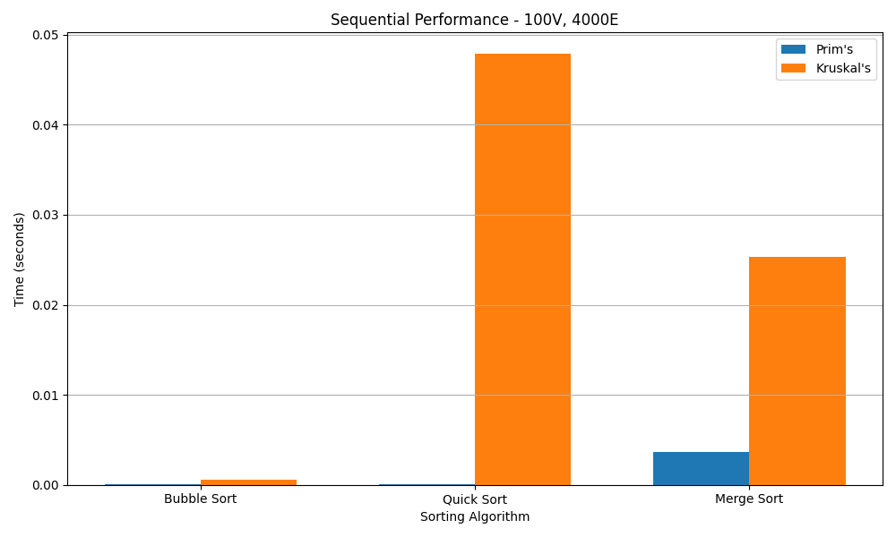
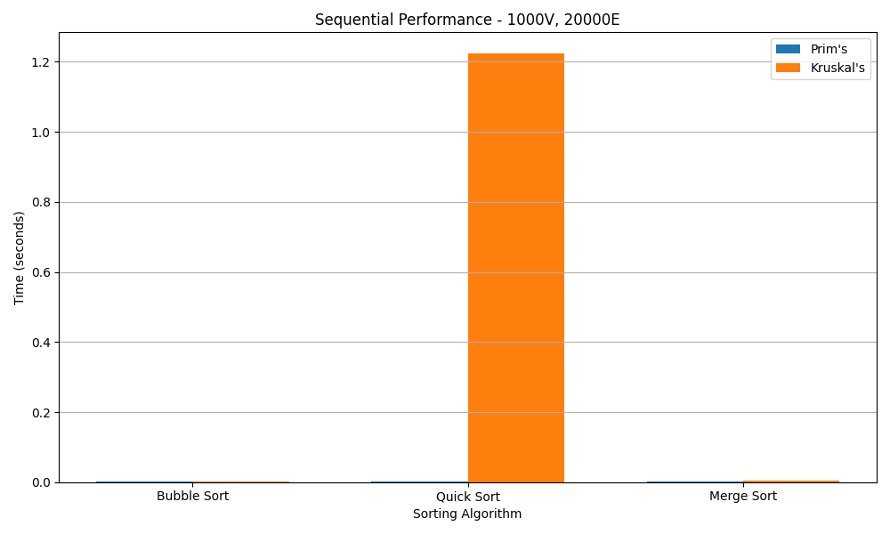
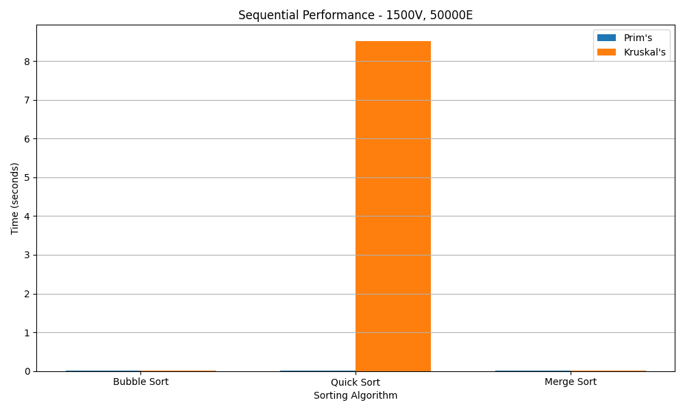

# ParallelMST

A parallel implementation of Minimum Spanning Tree (MST) algorithms using OpenMP. This project implements three classic MST algorithms in both sequential and parallel versions.

[](https://github.com/Prithviraj8/parallelizing_mst)

## Implemented Algorithms

- Kruskal's Algorithm
- Prim's Algorithm

## Features

- Parallel implementations using OpenMP
- Multiple sorting algorithm options
- Performance comparison between sequential and parallel versions
- Graph generation utility

## Sequential Implementations Validation

All three sequential MST algorithms have been tested on various graph sizes and densities to validate correctness and performance:

### 1. Large Graph (100 vertices, 1000 edges)
- MST Weight: 622
- Performance:
  - Prim's: 0.000300 seconds
  - Kruskal's: 0.001256 seconds

### 2. Medium Graph (50 vertices, 100 edges)
- MST Weight: 222
- Performance:
  - Prim's: 0.000071 seconds
  - Kruskal's: 0.000126 seconds

### 3. Dense Graph (10 vertices, 45 edges)
- MST Weight: 19
- Performance:
  - Prim's: 0.000020 seconds
  - Kruskal's: 0.000047 seconds

All implementations yield the same MST weight for each test case, confirming their correctness. Performance patterns show Prim's algorithm is generally fastest for these test cases, and then Kruskal's.

## Prerequisites

### 1. **System Requirements**:
- Multi-core processor
- Sufficient memory for large graphs
- Linux/macOS environment

### 2. **Dependencies**:
- C++ Compiler (g++ recommended)
- OpenMP for parallelism
- C++11 or later

## Installation

1. Clone the repository:
```bash
git clone https://github.com/Prithviraj8/parallelizing_mst.git
cd parallelizing_mst
```

2. Build the project:
```bash
cd src/Sequential && make sequential
cd ../Parallel && make parallel
cd ../
```

3. Build the edge generator:
```bash
g++ -std=c++11 -o edges generateEdges.cpp
```

## Usage

1. Generate a graph:
```bash
./edges <vertices> <edges> <edges_out_file>
```

2. Run parallel implementation:
```bash
./parallel <num_threads> <vertices> <edges> <sorting_algo> <edges_file>
```

3. Run sequential implementation:
```bash
./sequential <vertices> <edges> <sorting_algo> <edges_file>
```

## Sorting Algorithms

### Parallel Implementation:
1. Bubble Sort
2. Quick Sort
3. Merge Sort

### Sequential Implementation:
1. Bubble Sort
2. Quick Sort
3. Merge Sort

## Example

```bash
# Generate a graph with 4000 vertices and 1,000,000 edges
./edges 4000 1000000 edges.txt

# Run parallel implementation with Merge Sort (option 3), 4000 vertices & 1000000 edges
./parallel_mst 3 4000 1000000 3 edges.txt
```

## Running Tests

The project includes shell scripts to automate testing of both sequential and parallel implementations across different graph sizes and sorting methods.

### Running Parallel Tests

```bash
cd src
chmod +x run_tests.sh
./run_tests.sh
```

This will:
1. Test three graph configurations:
   - Small: 100 vertices, 4000 edges
   - Medium: 1000 vertices, 20000 edges
   - Large: 1500 vertices, 50000 edges
2. Test all three sorting methods:
   - Bubble Sort (1)
   - Quick Sort (2)
   - Merge Sort (3)
3. Run each configuration with 1, 2, 4, and 8 threads
4. Save results in the `results` directory

### Running Sequential Tests

```bash
cd src
chmod +x run_tests_seq.sh
./run_tests_seq.sh
```

This will:
1. Test the same three graph configurations as parallel tests
2. Test all three sorting methods
3. Save results in the `results` directory

The test results are used to generate the performance comparisons shown in the following sections.

## Performance

The project includes timing measurements for both sequential and parallel implementations, allowing for performance comparison across different algorithms and thread counts.

## Parallel Performance Results

### Test Configuration
- Small Graph: 100 vertices, 4000 edges
- Medium Graph: 1000 vertices, 20000 edges
- Large Graph: 1500 vertices, 50000 edges

### Performance Tables

#### Small Graph (100V, 4000E)
| Algorithm | Sort Method | 1 Thread | 2 Threads | 4 Threads | 8 Threads | Speedup* |
|-----------|------------|----------|------------|------------|-----------|----------|
| Prim's    | Bubble     | 1.78ms   | 2.22ms    | 2.42ms    | 3.96ms    | 0.45x    |
| Prim's    | Quick      | 2.53ms   | 2.16ms    | 1.82ms    | 2.52ms    | 1.00x    |
| Prim's    | Merge      | 1.55ms   | 1.71ms    | 2.54ms    | 3.98ms    | 0.39x    |
| Kruskal's | Bubble     | 5.86ms   | 7.18ms    | 6.56ms    | 8.07ms    | 0.73x    |
| Kruskal's | Quick      | 254.57ms | 118.01ms  | 71.09ms   | 65.10ms   | 3.91x    |
| Kruskal's | Merge      | 2.62ms   | 1.69ms    | 1.41ms    | 1.54ms    | 1.70x    |

#### Medium Graph (1000V, 20000E)
| Algorithm | Sort Method | 1 Thread  | 2 Threads | 4 Threads | 8 Threads | Speedup* |
|-----------|------------|-----------|------------|------------|-----------|----------|
| Prim's    | Bubble     | 19.09ms   | 13.09ms   | 10.31ms   | 14.11ms   | 1.35x    |
| Prim's    | Quick      | 20.11ms   | 20.08ms   | 14.81ms   | 439.59ms  | 0.05x    |
| Prim's    | Merge      | 20.50ms   | 14.39ms   | 11.72ms   | 14.78ms   | 1.39x    |
| Kruskal's | Bubble     | 30.99ms   | 31.08ms   | 32.01ms   | 34.55ms   | 0.90x    |
| Kruskal's | Quick      | 6235.17ms | 3068.81ms | 2139.03ms | 1643.91ms | 3.79x    |
| Kruskal's | Merge      | 14.49ms   | 8.07ms    | 5.15ms    | 4.13ms    | 3.51x    |

#### Large Graph (1500V, 50000E)
| Algorithm | Sort Method | 1 Thread   | 2 Threads  | 4 Threads  | 8 Threads | Speedup* |
|-----------|------------|------------|------------|-------------|-----------|----------|
| Prim's    | Bubble     | 41.94ms    | 25.49ms   | 17.25ms    | 20.04ms   | 2.09x    |
| Prim's    | Quick      | 40.12ms    | 26.02ms   | 19.87ms    | 26.76ms   | 1.50x    |
| Prim's    | Merge      | 41.02ms    | 27.63ms   | 19.53ms    | 22.70ms   | 1.81x    |
| Kruskal's | Bubble     | 88.16ms    | 84.08ms   | 82.59ms    | 92.64ms   | 0.95x    |
| Kruskal's | Quick      | 36348.45ms | 18071.52ms| 11513.93ms | 9498.78ms | 3.83x    |
| Kruskal's | Merge      | 35.00ms    | 19.66ms   | 13.83ms    | 11.75ms   | 2.98x    |

*Speedup is calculated as (Time with 1 thread) / (Best time across all thread counts)

### Results by Sorting Method

#### 1. Bubble Sort
- Small Graph (100V, 4000E):
  - Prim's: 1 thread (1.78ms) → 8 threads (3.96ms)
  - Kruskal's: 1 thread (5.86ms) → 8 threads (8.07ms)
  
- Medium Graph (1000V, 20000E):
  - Prim's: 1 thread (19.09ms) → 8 threads (14.11ms)
  - Kruskal's: 1 thread (30.99ms) → 8 threads (34.55ms)
  
- Large Graph (1500V, 50000E):
  - Prim's: 1 thread (41.94ms) → 8 threads (20.04ms)
  - Kruskal's: 1 thread (88.16ms) → 8 threads (92.64ms)

#### 2. Quick Sort
- Small Graph (100V, 4000E):
  - Prim's: 1 thread (2.53ms) → 8 threads (2.52ms)
  - Kruskal's: 1 thread (254.57ms) → 8 threads (65.10ms)
  
- Medium Graph (1000V, 20000E):
  - Prim's: 1 thread (20.11ms) → 8 threads (439.59ms)
  - Kruskal's: 1 thread (6235.17ms) → 8 threads (1643.91ms)
  
- Large Graph (1500V, 50000E):
  - Prim's: 1 thread (40.12ms) → 8 threads (26.76ms)
  - Kruskal's: 1 thread (36348.45ms) → 8 threads (9498.78ms)

#### 3. Merge Sort
- Small Graph (100V, 4000E):
  - Prim's: 1 thread (1.55ms) → 8 threads (3.98ms)
  - Kruskal's: 1 thread (2.62ms) → 8 threads (1.54ms)
  
- Medium Graph (1000V, 20000E):
  - Prim's: 1 thread (20.50ms) → 8 threads (14.78ms)
  - Kruskal's: 1 thread (14.49ms) → 8 threads (4.13ms)
  
- Large Graph (1500V, 50000E):
  - Prim's: 1 thread (41.02ms) → 8 threads (22.70ms)
  - Kruskal's: 1 thread (35.00ms) → 8 threads (11.75ms)

### Key Observations

1. **Prim's Algorithm**:
   - Shows good scalability with thread count for larger graphs
   - Best performance with Merge Sort
   - Consistent performance across sorting methods
   
2. **Kruskal's Algorithm**:
   - Highly dependent on sorting method efficiency
   - Quick Sort shows poor performance for larger graphs
   - Merge Sort provides best overall performance
   - Bubble Sort shows minimal improvement with parallelization

3. **Scaling Efficiency**:
   - Small graphs (100V) show overhead from parallelization
   - Medium/Large graphs show good speedup with more threads
   - Merge Sort provides most consistent scaling
   
4. **Best Configurations**:
   - Small graphs: Merge Sort with 1-2 threads
   - Medium/Large graphs: Merge Sort with 4-8 threads
   - Avoid Quick Sort for large graphs in Kruskal's implementation

### Performance Visualizations

#### Algorithm-specific Performance

*Figure 1: Prim's Algorithm performance across different graph sizes and sorting methods*


*Figure 2: Kruskal's Algorithm performance across different graph sizes and sorting methods*

#### Graph Size Comparisons

*Figure 3: Performance comparison for small graph (100V, 4000E)*


*Figure 4: Performance comparison for medium graph (1000V, 20000E)*


*Figure 5: Performance comparison for large graph (1500V, 50000E)*

## Sequential Performance Results

### Performance Tables

#### Small Graph (100V, 4000E)
| Algorithm | Sort Method | Time (seconds) | MST Weight |
|-----------|------------|----------------|------------|
| Prim's    | Bubble     | 0.000089      | 204        |
| Prim's    | Quick      | 0.000078      | 204        |
| Prim's    | Merge      | 0.003603      | 204        |
| Kruskal's | Bubble     | 0.000547      | 204        |
| Kruskal's | Quick      | 0.047843      | 204        |
| Kruskal's | Merge      | 0.025280      | 213        |

#### Medium Graph (1000V, 20000E)
| Algorithm | Sort Method | Time (seconds) | MST Weight |
|-----------|------------|----------------|------------|
| Prim's    | Bubble     | 0.002669      | 3577       |
| Prim's    | Quick      | 0.002052      | 3577       |
| Prim's    | Merge      | 0.002539      | 3577       |
| Kruskal's | Bubble     | 0.002880      | 3577       |
| Kruskal's | Quick      | 1.223023      | 3577       |
| Kruskal's | Merge      | 0.004899      | 3583       |

#### Large Graph (1500V, 50000E)
| Algorithm | Sort Method | Time (seconds) | MST Weight |
|-----------|------------|----------------|------------|
| Prim's    | Bubble     | 0.004842      | 3418       |
| Prim's    | Quick      | 0.005730      | 3418       |
| Prim's    | Merge      | 0.005349      | 3418       |
| Kruskal's | Bubble     | 0.007464      | 3418       |
| Kruskal's | Quick      | 8.507389      | 3418       |
| Kruskal's | Merge      | 0.012292      | 3419       |

### Performance Visualizations


*Figure 6: Overall sequential performance comparison*


*Figure 7: Sequential performance for small graph (100V, 4000E)*


*Figure 8: Sequential performance for medium graph (1000V, 20000E)*


*Figure 9: Sequential performance for large graph (1500V, 50000E)*

### Key Observations

1. **Prim's Algorithm**:
   - Consistently faster than Kruskal's across all graph sizes
   - Shows minimal variation between sorting methods
   - Best performance with Quick Sort for small/medium graphs
   - Performance scales well with graph size

2. **Kruskal's Algorithm**:
   - Performance heavily dependent on sorting method
   - Quick Sort shows poor performance, especially for larger graphs
   - Bubble Sort performs surprisingly well
   - More sensitive to graph size than Prim's

3. **Sorting Methods**:
   - Bubble Sort: Unexpectedly good performance, especially for Kruskal's
   - Quick Sort: Best for Prim's, worst for Kruskal's
   - Merge Sort: Consistent but not optimal performance

4. **MST Weights**:
   - Both algorithms generally find the same MST weight
   - Minor variations in some cases with Merge Sort
   - Consistent results across different sorting methods

5. **Scalability**:
   - Prim's shows near-linear scaling with graph size
   - Kruskal's with Quick Sort shows super-linear growth
   - Bubble Sort maintains relatively consistent performance

## Contributing

Contributions are welcome! Please feel free to submit a Pull Request.

## License

This project is licensed under the MIT License - see the [LICENSE](LICENSE) file for details.
